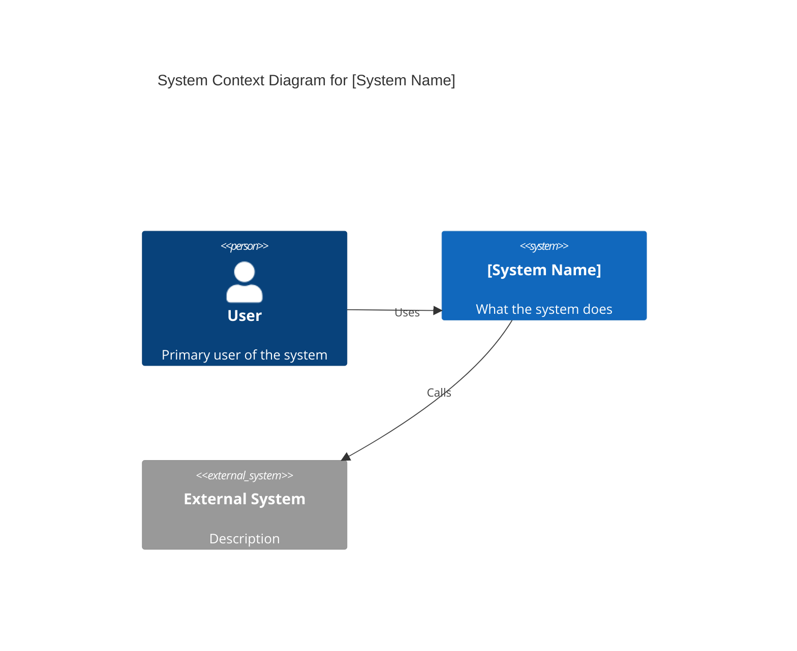
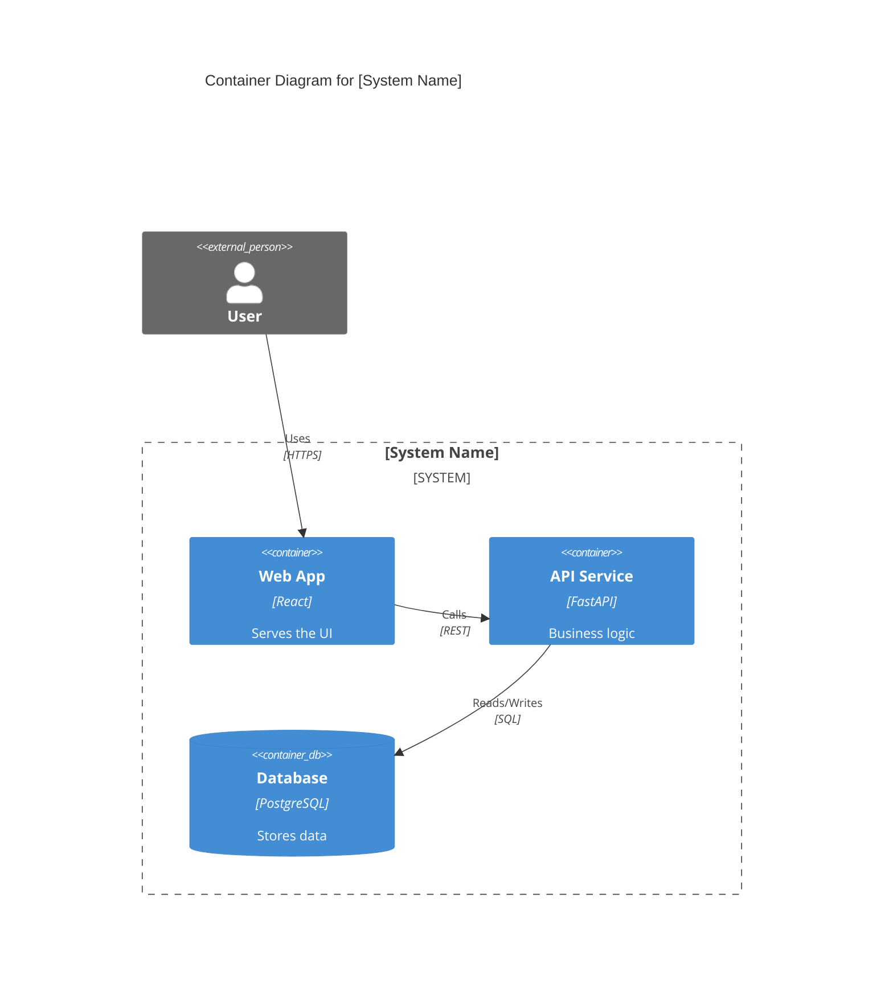
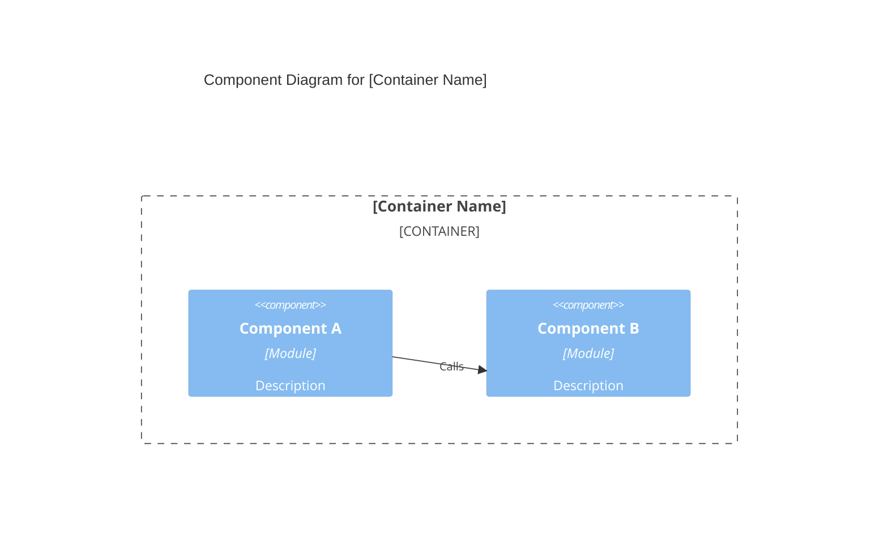

# C4 Architecture

Generates C4 model diagrams at one or more of the four abstraction levels by reading the codebase and writing Mermaid syntax output. Does not produce UML class diagrams, sequence diagrams, flowcharts, or visual design mockups — those belong to visualize or gateway-aesthetic.

## What this skill does

Analyzes project structure (file system, imports, CLAUDE.md, wabblespec.yaml) to produce Mermaid C4 diagrams at the requested level. Writes output as a fenced Mermaid block in a markdown file. Four levels, each a superset of the one below:

- **Level 1 — Context**: System in its environment. Shows the primary system box plus external actors (users, external systems). One diagram. Fewest boxes (aim for 3–8).
- **Level 2 — Container**: Processes, datastores, and services inside the system boundary. Shows what runs and how components communicate.
- **Level 3 — Component**: Module decomposition within a single container. Shows internal packages, skills, scripts, or classes.
- **Level 4 — Code**: Key class-level or function-level detail within a single component. Most granular; use only when requested.

## When to use

- User asks for architecture diagram, system map, or C4 model
- User asks "how is this system structured" or "show me an overview"
- User asks specifically for Context, Container, Component, or Code level
- Preparing documentation for a new contributor or onboarding artifact

## When NOT to use

- User wants a sequence diagram, flowchart, or state machine — those are not C4 and belong to visualize
- User wants visual UI mockups or design layouts — use gateway-aesthetic
- User wants the existing diagram reviewed, not generated — use wave-review
- No codebase is present (pure conversation context) — cannot analyze structure

## Inputs

| Field | Default | Notes |
|---|---|---|
| `level` | `1-2` | Which level(s) to produce: `1`, `2`, `3`, `4`, `1-2`, `1-3`, or `all` |
| `scope` | auto-detect | Which container/component to zoom into for levels 3-4 |
| `output_path` | `docs/architecture/c4.md` | Where to write the diagram file |
| `format` | `mermaid` | Always Mermaid for now; PlantUML not yet supported |

## How to do it

### Step 1 — Read project context

Read in parallel:
- `CLAUDE.md` (project identity, architecture description)
- Root `README.md` if present (system purpose, tech stack)
- `.wabblespec/wabblespec.yaml` module list (if WabbleSpec project)
- `package.json`, `pyproject.toml`, or `Cargo.toml` if present (dependency graph)
- Top-level directory listing (identifies containers: services, dbs, frontends)

Do not read more than 8 files in this step.

### Step 2 — Extract actors and boundaries

**For Level 1 (Context):**
- Identify the primary system: what is being built
- Identify external actors: users (personas from README/CLAUDE.md), external systems (APIs, databases outside the boundary, auth providers)
- Aim for 3–8 boxes total; merge related actors

**For Level 2 (Container):**
- From directory structure: identify top-level services, datastores, CLIs, frontends
- From dependency files: identify what runs as a separate process
- Mark communication paths (HTTP, queue, file-based, in-process calls)

**For Level 3 (Component):**
- Read the specific container's directory listing
- Identify modules, packages, skill groups, or subsystems
- Show how they call each other (import chains or documented interfaces)

**For Level 4 (Code):**
- Read specific files in the target component
- Identify key classes, functions, or data structures
- Show inheritance, composition, or key call chains

### Step 3 — Write Mermaid C4 diagram

Use the C4 Mermaid syntax. See `references/c4-mermaid-syntax.md` for full reference.

**Level 1 (Context) template:**


**Level 2 (Container) template:**


**Level 3 (Component) template:**


**Level 4 (Code) template:**
```mermaid
C4Code
  title Code Diagram for [Component Name]
  class ClassA {
    +method1()
    -field1: string
  }
  ClassA --> ClassB : uses
```

### Step 4 — Write output file

Write the diagram(s) to `output_path` as a markdown file with:
- H1 heading: "Architecture Overview" (or level-specific title)
- One fenced Mermaid block per level produced
- One paragraph per diagram explaining what it shows and the key insight (the most important relationship visible at this level that would not be obvious without the diagram)

If the file already exists, append new diagrams below the existing content rather than overwriting.

### Step 5 — Report

State:
- Level(s) produced
- Number of boxes/actors in each diagram
- Output path
- One insight per diagram (the key architectural decision visible at this abstraction level)

Do not write a receipt. This skill produces a documentation artifact, not an execution artifact.

## Pitfalls

- **Over-boxing Level 1**: Context diagrams with >10 boxes are unreadable. Merge related external systems, collapse user types into representative personas.
- **Confusing containers with components**: A container is a separately deployable process (a service, a CLI, a database). A component is a module inside a container. Do not mix levels.
- **Missing communication paths**: The most common omission at Level 2 is failing to show how containers talk to each other. Read dependency configs before drawing.
- **Showing too much at Level 4**: Code-level diagrams are only useful when zoomed into a single class or function cluster. Showing all classes in a file produces an unreadable diagram.
- **Writing PlantUML when Mermaid is requested**: Only Mermaid is supported. Do not produce `@startuml` syntax.

## Output contract

Writes a markdown file at `output_path` (default: `docs/architecture/c4.md`) containing:
- One H1 heading
- One fenced Mermaid code block per level produced
- One explanatory paragraph per diagram (key architectural insight)

No receipt written. No wabblespec.yaml mutation. No .wabblespec/ writes.

## Reference Routing

| Situation | Reference |
|---|---|
| Full Mermaid C4 syntax with all shape types | `references/c4-mermaid-syntax.md` |
