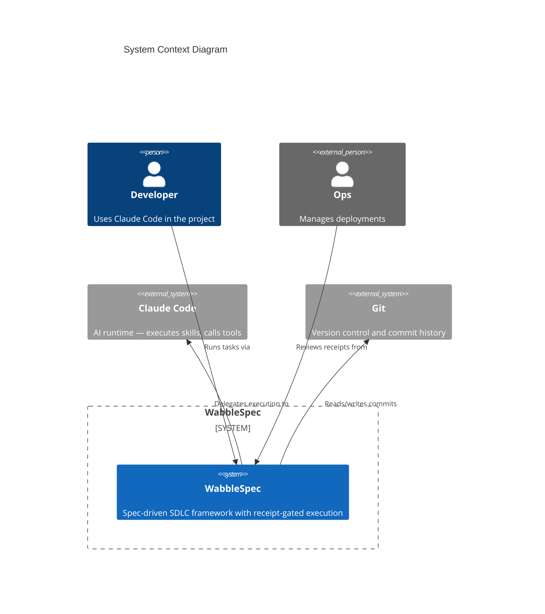
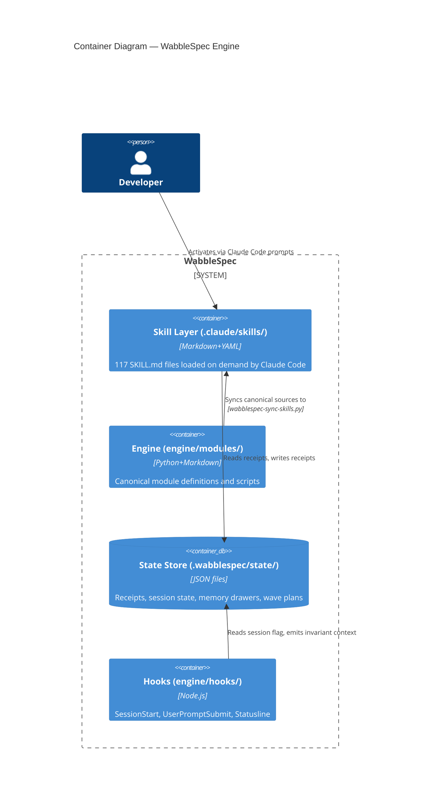
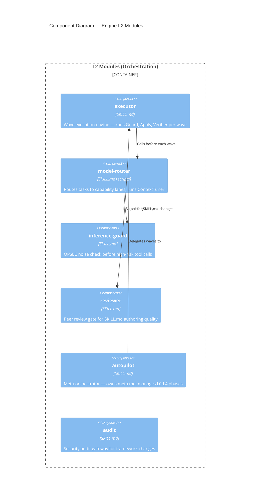

# C4 Mermaid Syntax Reference

Mermaid's C4 diagram support maps directly to the C4 model's four levels.

## Supported Shape Types

### People
```
Person(alias, label, description)          # internal person
Person_Ext(alias, label, description)      # external person
```

### Systems
```
System(alias, label, description)          # internal system
System_Ext(alias, label, description)      # external system
System_Db(alias, label, description)       # database system
System_Queue(alias, label, description)    # queue system
```

### Containers
```
Container(alias, label, tech, description)
ContainerDb(alias, label, tech, description)
ContainerQueue(alias, label, tech, description)
```

### Components
```
Component(alias, label, tech, description)
ComponentDb(alias, label, tech, description)
ComponentQueue(alias, label, tech, description)
```

### Boundaries
```
System_Boundary(alias, label) { ... }
Container_Boundary(alias, label) { ... }
Enterprise_Boundary(alias, label) { ... }
```

### Relationships
```
Rel(from, to, label)
Rel(from, to, label, technology)
BiRel(from, to, label)
Rel_Back(from, to, label)
Rel_Neighbor(from, to, label)       # hint: draw adjacent
Rel_D(from, to, label)              # explicit direction: down
Rel_U(from, to, label)              # up
Rel_L(from, to, label)              # left
Rel_R(from, to, label)              # right
```

### Layout hints
```
UpdateLayoutConfig($c4ShapeInRow, $c4BoundaryInRow)
  # e.g. UpdateLayoutConfig("3", "2") — 3 shapes per row, 2 boundaries per row
```

## Level 1 — Context Example



## Level 2 — Container Example



## Level 3 — Component Example (Engine Modules)



## Common Mistakes

- Alias must be alphanumeric+underscore — no hyphens: use `model_router` not `model-router`
- `Rel` direction follows argument order: `Rel(A, B, label)` draws A → B
- Boundaries must wrap with `{ }` on separate lines — inline is not supported
- `C4Code` level uses class diagram syntax, not C4 shapes
- All strings with spaces must be quoted: `"My Label"` not `My Label`
